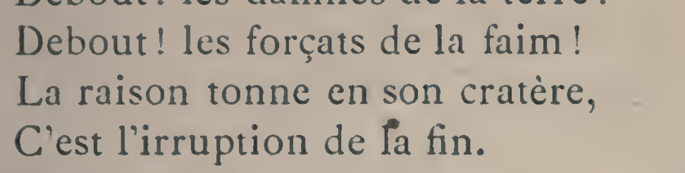
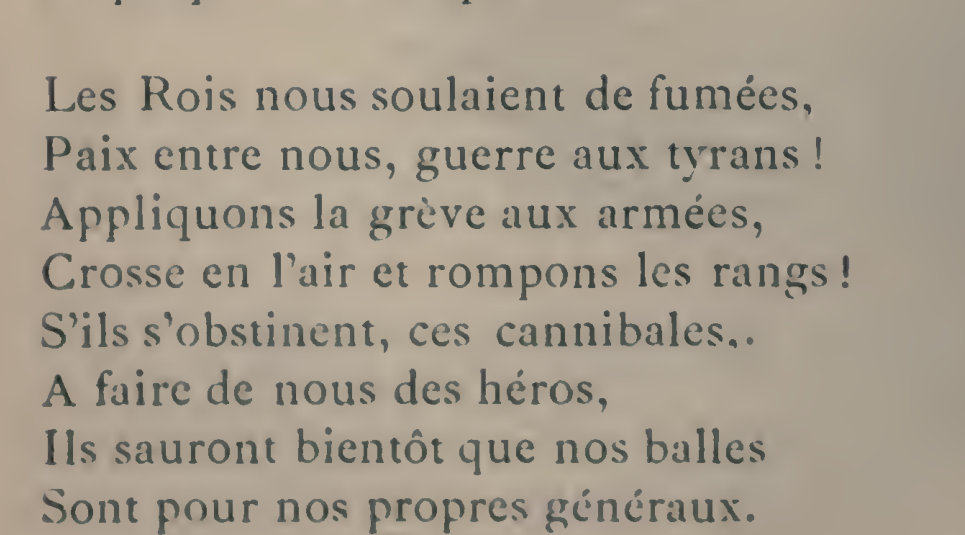

# 鲍狄埃1887年刊本的转录与对照

核对日期：2026年10月3日。

## 所据文献

Eugène Pottier, *Chants révolutionnaires*, préface de Henri Rochefort, Paris: Dentu et Cie, 1887，第13–15页。书名、出版者、年代经题名页核对；《国际歌》篇末署“Paris, juin 1871.”。

所读扫描来自[Internet Archive的多伦多大学Robarts图书馆藏本](https://archive.org/details/chantsrvolutio00pottuoft)，馆藏号按元数据记为AFN-9506；数字化来源与1887年原刊年代分开记录。下载文件SHA-1与该站元数据一致。文件摘要和电子页序对应保存在[技术记录](../../data/collations/fr-pottier-1887.json)，全文扫描不随仓库分发；下列两幅局部用于定位疑读。

已目视检查全部六段正文及两次副歌，形成[含疑读的阅读转录](../../lyrics/fr/fr-pottier-1887.md)。空白和标点间距经过统一；保留原分行、大小写和可辨标点。两处疑读仍未解决，因此不称逐字定稿。

## 待复核的位置

| 编号 | 印刷页码与位置 | 暂读 | 待判断的问题 |
|---|---|---|---|
| FR1887-01 | 第13页，第一段第四行，`de` 后的词首 | `⟦l/f?⟧a` | 首字母是受墨迹影响的l，还是实际排成f？语法可以提示la，不能代替字形判断。 |
| FR1887-02 | 第14页，第五段第五行，`cannibales` 后 | `⟦..?⟧` | 两个点状印迹的第一处是逗号、句点，还是其他印刷痕迹？ |

FR1887-01：整行及上下文。

FR1887-02：第五段上下文。

获得复核意见后，记录意见与据图判断，再更新转录、摘要和版本状态。没有意见时保留疑读；OCR的`fa lin`不能作为定字依据。

## 与1908年网页转录的差异

比较对象为仓库[1908年版网页转录](../../lyrics/fr/fr-pottier-1908.md)所据的[固定网页](https://fr.wikisource.org/w/index.php?title=L%E2%80%99Internationale&oldid=14171457)。本轮没有取得1908年对应版面，以下不能直接证明两个印刷刊本的异文关系，也不判断改词由作者还是编者所作。

| 位置 | 1887年扫描 | 1908年网页 | 处理 |
|---|---|---|---|
| 第一段第三行，第13页 | `cratère,` | `cratère :` | 分别保留标点 |
| 第一段第四行，第13页 | `irruption` | `éruption` | 分别保留词形；后续核对1908年版面 |
| 第三段第七行，第14页 | `dit-elle,` | `dit-elle` | 保留1887年行末逗号 |
| 第三段第八行，第14页 | 行首 `»` | 行首 `«` | 保留可见符号，不自动纠正 |
| 第四段第六行，第14页 | `fondu.` | `fondu` | 保留1887年句点 |
| 第五段第一行，第14页 | `soulaient` | `soûlaient` | 保留1887年可见的无长音符字形 |
| 第五段第四行，第14页 | `Crosse en l’air et` | `Crosse en l’air, et` | 1887年不补逗号 |
| 第五段第五行，第14页 | 行末标点待复核 | `cannibales,` | 不凭网页定标点 |
| 第五段第六行，第14页 | `A faire` | `À faire` | 保留1887年可见的无重音大写A |
| 两次副歌末行，第13、15页 | `humain.` | `humain` | 保留1887年句点 |

首字母疑读不影响`irruption`的辨认。1887年文本与1908年网页的字词范围已比对，但后者仍保持“原刊影印校勘待完成”的状态。

## 本轮中文原刊检索

北京大学图书馆的[《民国日报》数据库说明](https://lib.pku.edu.cn/2xxzzfw/26xwgg/gm/44498288a7fc4faa83ef657c2887a305.htm)还列有繙云历史文献库，说明采用国家图书馆授权图档，并含上海版与《觉悟》副刊；这是检索入口，不是目标两日版面的核对证据。

- 耿济之、郑振铎：仍未取得1921年5月7日或27日《民国日报·觉悟》版面；首刊日期冲突保留。苏州大学图书馆的[数据库说明](https://library.suda.edu.cn/2017/0727/c4858a52100/page.psp)明确列有1919–1947年《民国日报》数字资源，可作为下一次按日期检索的入口；不能据此断言目标两日版面已读或齐全。
- 《小说月报》第12卷号外《俄国文学研究》第235–237页：重刊线索保留，本轮没有取得目标页面。[NDL书目](https://ndlsearch.ndl.go.jp/books/R100000136-I1970304959787812097)与[CiNii书目AA11575553](https://ci.nii.ac.jp/ncid/AA11575553)已明确列出这期号外，并将影印版出版信息记为书目文献出版社，1981–1988。NDL条目来自CiNii，两者不当作独立原刊证据；联合目录的总体馆藏列表也不能保证每馆都有号外。后续优先查各馆分册记录，再取得第235–237页。
- 《人民日报》1962年4月28日第6版：现有[第三方网页](https://www.rmrb.zhouenlai.info/%E4%BA%BA%E6%B0%91%E6%97%A5%E6%8A%A5%EF%BC%881946-2003%EF%BC%89/1962/04/1962-04-28.htm)只有题名、注释及刊载说明，未取得谱词版面；继续仅索引。

下一步先处理两处法语疑读，再取得1908年对应页核对；中文继续沿明确的日期和刊次找原件。
